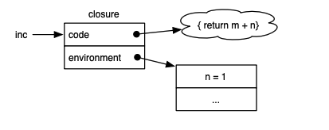

# Closure Anatomy

Em linguagens de programação (por que podemos falar sobre closure no mundo matemático), uma *closure* (ou *lexical closure*, ou *function closure*) é uma técnica que implementa o escopo léxico (lexically scoped name binding) em linguagens com funções de primeira classe (*first-class functions*).

De acordo com CORNELL, funções de primeira classe são as que:

1. Podem ser atribuida a uma variavel
2. Podem ser passada como argumento de funcões
3. elas podem ser retornadas como resultados de função
4. elas podem ser armazenadas em estrutura de dados

Funções são de primeira classe em várias linguagens, especialmente as consideradas funcionais: ML, Haskell, Scheme, Common Lisp.

Mas, muitas outras linguagens como JavaScript e Python, possuem funções de primeira classe, e esse recurso foi até mesmo adotado por linguagens que não ofereciam suporte a funções de primeira classe como Java e C++.

### Problema

Em ciência da computação, o problema de funarg é sobre uma função que é passada por argumento, e não consegue "lembrar" do ambiente onde foi criada. 

Por exemplo, nativamente, C / Pascal não oferece suporte a isto, então é possível simular este erro, por que as variáveis locais são armazenado na pilha, e o escopo da função não é preservado após a execução do bloco onde foi declarado.

Uma proposta e implementação de closure syntax para C pela Apple, resolve este problema de funarg por dinâmicamente mover closures da Stack para Heap quando necessário.

### Implementações

A implementação de Jlox [CRAFTING], usa a HEAP para manter closures por tempo suficiente até não ser preciso, por que C e Java armazenam variáveis locais em pilhas.

```lua
function makeClosure() {
  let local = 42;        ← variável local
  return function () {   ← closure capturando "local"
    return local;
  }
}
```

```bash
[ P I L H A ]                [ H E A P ]
-----------                ----------------
| x = 1   |  -- usado em →  | local = 42 | ← usado por closure
| y = 5   |                  ----------------
| z = 10  |
-----------
```

Operacionalmente, a closure armazena uma função, junto com o ambiente (contexto). 




Neste estudo, vou apresentar Closure em pelo menos 3 linguagens: 

- JavaScript (https://developer.mozilla.org/pt-BR/docs/Web/JavaScript/Guide/Closures)

- Go (https://www.geeksforgeeks.org/closures-in-golang/)

- Ruby (https://www.geeksforgeeks.org/closures-in-ruby/)

Os 3 exemplos estão em pastas separadas, mas pode testar todas com docker:


```bash
docker build -t closures-test .
docker run --rm closures-test
```

Output deve ser:

```bash
➜  closure-anatomy git:(main) docker run --rm closures-test
=== Executando JavaScript - Deno runtime ===
JS is Ok
=== Executando Ruby ===
Ruby is OK
=== Executando Go ===
Go is ok
```

Leia as referêncas, vai ajudar a ter um entendimento mais profundo.

Até logo.


## Referências

CORNELL UNIVERSITY. Compiling first-class functions. Disponível em: <https://www.cs.cornell.edu/courses/cs4120/2021sp/lectures/34functional/lec34-sp21.pdf?1624078698>. Acesso em: 1 maio 2025.

CRAFTING INTERPRETERS. Closures. Disponível em: <https://craftinginterpreters.com/closures.html>. Acesso em: 1 maio 2025.

WIKIPEDIA. Closure (computer programming). Disponível em: <https://en.wikipedia.org/wiki/Closure_(computer_programming)>. Acesso em: 1 maio 2025.

WIKIPEDIA. Scope (computer science). Disponível em: <https://en.wikipedia.org/wiki/Scope_(computer_science)#Lexical_scope>. Acesso em: 1 maio 2025.

WIKIPEDIA. First-class function. Disponível em: <https://en.wikipedia.org/wiki/First-class_function>. Acesso em: 1 maio 2025.

MIGHT, Matt. *Closure Conversion*. Disponível em: <https://matt.might.net/articles/closure-conversion/>. Acesso em: 12 out. 2023.

HASKELL Foundation. *Lambda Lifting*. Disponível em: <https://haskell.foundation/hs-opt-handbook.github.io/src/Optimizations/GHC_opt/lambda_lifting.html>. Acesso em: 12 out. 2023.

WIKIPEDIA. *Funarg Problem*. Disponível em: <https://en.wikipedia.org/wiki/Funarg_problem>. Acesso em: 12 out. 2023.

